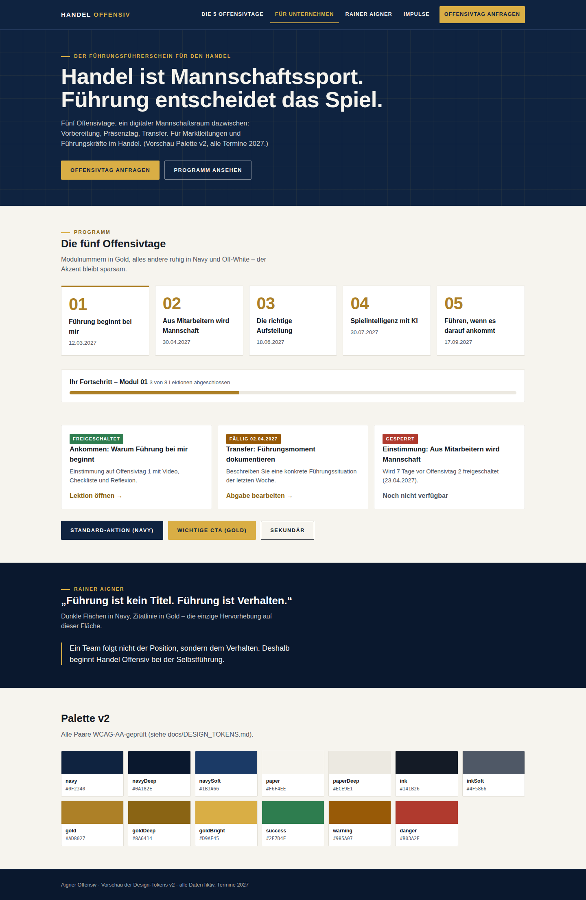
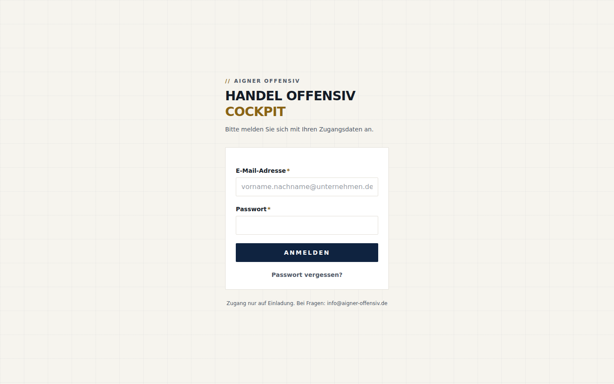

# Zwischenbericht nach Phase 0 + 1 – Aigner Offensiv Digital

**Stand: 26.09.2026 · Branch `claude/aigner-offensiv-redesign-fpxwht` · Status: STOPP, wartet auf Freigabe für den Vertical Slice (Phase 2).**

Grundlage: Freigabe des Plans A–L vom 26.09.2026 mit 14 verbindlichen Änderungen. Reihenfolge eingehalten: **Sicherheit → Infrastruktur → E‑Mail → (Vertical Slice folgt)**. Keine produktive DNS- oder Datenbankänderung wurde vorgenommen; es existieren noch keine Staging-/Produktionsprojekte (Konten liegen beim Auftraggeber, siehe `NEEDED_FROM_CLIENT.md`).

---

## A. Behobene Sicherheitsbefunde

| Nr. | Befund | Behebung | Nachweis |
|---|---|---|---|
| **S‑1** | Freischaltzeit nur im Client geprüft; gesperrte Lektionen per API lesbar | `app.lesson_is_released(lesson, profil, zeitpunkt)` in SQL (Migration 0003) spiegelt die Release-Engine 1:1 (alle 7 Modi, halboffenes Zeitfenster, individuelle vor Gruppenregel) und prüft zusätzlich: Profil aktiv, Organisation aktiv, Mitgliedschaft aktiv, Gruppe aktiv (nicht archiviert), Gruppenzuordnung **und** Einschreibung, Programm/Modul/Lektion veröffentlicht. Wird von den RLS-Policies für `lessons` → `content_blocks` → `quizzes` bei **jedem Zugriff** ausgewertet. **Keine Cron-Abhängigkeit** (Vorgabe 7): der `release-scheduler` löst nur noch Benachrichtigungen aus. | `supabase/tests/src/03_freischaltung.test.ts` – 22 Tests |
| **S‑2** | IDOR in `setMembershipStatusAction` / `changeCohortAction` | Jede Mutation an die geprüfte Organisation gebunden (`.eq("organization_id", …)` + Treffer-Prüfung); Zielgruppe muss zur Organisation gehören; Person muss Mitglied der Organisation sein; Einschreibung wird mitgeführt | `02_id_manipulation.test.ts` (DB-Ebene), Code-Review `teilnehmer/actions.ts` |
| **S‑5** | Deaktivierung unvollständig | `app.current_profile_id()` liefert nur für aktive Profile einen Wert → alle Policies (auch „eigene Zeilen") greifen sofort nicht mehr; inaktive Mitgliedschaft/Gruppe/Organisation kappt den Zugriff ebenfalls sofort; Admin-Aktion sperrt zusätzlich das Auth-Konto (GoTrue `ban_duration`) und hebt die Sperre bei Reaktivierung auf | `04_deaktivierung.test.ts` – 8 Tests |
| **S‑14 / I‑1** | Admin ruft Edge Functions mit dem Service-Role-Key auf (Functions lehnen ab, Rechteprüfung entfiele) | `apps/admin/src/lib/edge-functions.ts`: Aufruf mit dem **JWT der angemeldeten Person**, `apikey` = anon key, Header `x-region: eu-central-1`; Service-Role-Aufrufe entfernt (Einladungen, Push) | Typecheck/Lint; Vertragsabgleich Admin ↔ Function |
| **I‑2** | Inkompatibler Einladungsvertrag (Mobile `accept`/`consentPrivacy` vs. Function `complete`/`consentPrivacyVersion`) | Ein verbindlicher Vertrag (`validate` → `{ok, invitation}`, `complete` → `{ok, email, …}`, Fehler `{ok:false, error, code}`), Mobile und Admin angepasst, `PRIVACY_POLICY_VERSION` zentral in `@handel-offensiv/config`, `cohortId: null`-Fehler im Admin behoben | Mobile-Typecheck, Function-Typecheck (Deno) |
| **I‑3 / S‑19** | Kein Passwort-Reset-Endpunkt/Screen; Redirect-Allowlist leer | Cockpit: `/login/passwort-vergessen` → `/auth/callback` (PKCE-Code-Tausch, Open-Redirect-Schutz) → `/passwort-neu` (Mindestlänge 10, Bestätigung, danach globaler Logout); Mobile-Screen `passwort-neu` (implicit + PKCE); `config.toml` mit Allowlist je Umgebung | Screenshots G, Typechecks |
| **S‑8 / S‑17 (teilweise)** | Storage ohne Limits, kein Upload-Bucket | Bucket `participant-uploads` mit Pfad-RLS (0004); MIME-/Größenlimits je Bucket (0006) | Migrationen laufen; Policies im Test-Harness |
| **S‑9** | Demo-Passwort im Repository | Seed v2 legt Konten **ohne** Passwort an; Passwörter nur per `seed-users.mjs` aus Umgebungsvariable; Produktionsschutz im Seed | `supabase/seed.sql`, `seed-users.mjs` |
| **S‑11 / S‑20** | CI mit `\|\| true`, keine RLS-/Function-Tests | ESLint verbindlich (0 Fehler), RLS-Tests gegen PostgreSQL 16 im CI, `deno check` aller Functions | `.github/workflows/handel-offensiv-ci.yml` |
| **S‑12** | `site_url` localhost, Allowlist leer | `config.toml`: `site_url` per Umgebung, Allowlist für Admin/Campus/App, Passwortregeln, Auth-SMTP (Resend) | – |
| **Zusätzlich** | Schreibzugriffe (Fortschritt, Abgaben, Reflexionen, Quizversuche) auf gesperrte Lektionen; Verschieben eigener Lerndaten in fremde Gruppen/Profile; Trainer ohne aktive Mitgliedschaft; Konsistenz Gruppe↔Organisation als Orakel | Policies nur auf **sichtbare** Lektionen/Blöcke; Schlüssel-Schutz-Trigger; Trainer benötigen aktive Mitgliedschaft in der Organisation der Gruppe; Konsistenz-Trigger (SECURITY DEFINER, einheitliche Meldung) | `02_…`, `03_…`, `01_…` |

**Pflicht-Negativtests des Auftraggebers (alle grün):** Teilnehmer A ↔ B · fremde Reflexion (auch trainer-sichtbar) · Trainer A ↔ Gruppe B · Org-Admin A ↔ Organisation B · IDs in Requests (Profile, Gruppen, Organisationen, Releases, Feedback, Ankündigungen) · gesperrte Lektionen über Direktabfrage (alle 7 Modi, Zeitgrenzen sekundengenau) · deaktivierte Konten (Profil, Mitgliedschaft, Gruppe, Organisation, Trainer, Org-Admin, Super-Admin).

## B. Verbleibende Risiken

| Risiko | Einordnung | Geplante Behebung |
|---|---|---|
| **S‑3** Quiz: `is_correct` für Teilnehmer lesbar, `score/passed` vom Client schreibbar | mittel – Lernstand, kein Datenschutzrisiko | Phase 2 mit dem Campus-Quiz: View ohne `is_correct`, Bewertung per RPC (Client-Umbau nötig, deshalb nicht isoliert vorgezogen) |
| **S‑4** Admin schreibt weiterhin über Service Role (mit Scope-Bindung) | mittel | K‑13: Lesen über Nutzersitzung beim Aufbau von `packages/ui`/Campus |
| **S‑6** CSP und Rate Limit im Admin fehlen (Security-Header via `vercel.json` gesetzt) | mittel | Phase 2 (`app.rate_limit_take` liegt in 0006 bereit) |
| **S‑7** MFA nicht erzwungen | mittel | Phase 2/4 |
| **S‑10, S‑15, S‑16, S‑18** | niedrig–mittel | Phasen 2–4 laut Plan |
| **S‑13 WordPress (PHP 7.4)** | hoch, organisatorisch | Leitfaden `WORDPRESS_BACKUP_UND_HAERTUNG.md`; Umsetzung durch den Auftraggeber (Backup zuerst, PHP nur über Staging) |
| **Vercel Edge Middleware** läuft global (nur Cookie-Prüfung, keine Daten) | niedrig, dokumentiert | Alternative (Server-Component-Gate) bei Bedarf; `REGIONS_AND_DATA_FLOWS.md` |
| **E‑Mail-Zustellung** noch nicht real getestet | mittel – blockiert den Vertical Slice | Resend-Konto, API-Schlüssel, DNS (siehe E) |
| **Repository weiterhin öffentlich** (Vorgabe 12) | mittel | Privates Repo durch den Auftraggeber anlegen; Umzug ohne Historienverlust |
| **Verhaltensänderung:** Trainer ohne aktive Mitgliedschaft in der Organisation der Gruppe sehen die Gruppe nicht mehr | gewollt, muss den Nutzern bekannt sein | Admin-Zuordnung legt die Mitgliedschaft jetzt automatisch an |
| **Mobile-App**: neue Blocktypen werden nur als Hinweis gerendert; Palette über Aliasse | niedrig (native App erst Phase 9) | Phase 9 |
| **Seed 2027**: in der lokalen Entwicklung „heute" sind nur Modul-01-Lektionen frei | gewollt (Vorgabe 13) | Entwickler nutzen den Zeitparameter der Funktion bzw. Trainer-Freigabe |

## C. Migrationen

| Datei | Inhalt | Status |
|---|---|---|
| `0003_release_rls_hardening.sql` | Freischaltlogik in RLS, Deaktivierungskaskade, Schreibzugriffe nur auf sichtbare Inhalte, Uniques je Gruppe, `audit_logs.organization_id`, Schutz-Trigger | lokal auf PostgreSQL 16 angewendet, getestet |
| `0004_v2_block_types_uploads.sql` | 4 neue Blocktypen, `assignment_submissions.answers`, `submission_files`, Bucket `participant-uploads` | dito |
| `0005_v2_website_cms.sql` | Website-Redaktion: `site_status` draft/preview/published/archived, `site_content` + `site_content_drafts`, `site_posts` mit Arbeitsstand, `inquiries`, Veröffentlichen nur über `app.publish_site_*` (nichts geht beim Tippen live) | dito |
| `0006_v2_hardening_extras.sql` | Konsistenz-Trigger, `block_responses`, `session_notes`, `notification_preferences`, Web-Push, `program_progress`, `rate_limits`, Storage-Limits | dito |
| `seed.sql` (v2) + `seed-users.mjs` | fiktive „Muster Handelsgruppe GmbH", Gruppe „Marktleiter Süd – Frühjahr 2027", Termine 12.03./30.04./18.06./30.07./17.09.2027, alle Blocktypen, keine Passwörter | läuft fehlerfrei auf 0001–0006 |

**Noch nicht angewendet auf Staging/Produktion** – es gibt noch kein Supabase-Projekt. Vor der ersten Anwendung wird laut Vorgabe 14 angezeigt: was geändert wird (Schema-Aufbau 0001–0006 in ein leeres Projekt), Auswirkungen (keine, da leer), Rollback (Projekt zurücksetzen).

## D. RLS-Testresultate

Testharness: `supabase/tests/` – Vitest + `pg` gegen ein nacktes PostgreSQL 16 mit Supabase-Shim (Rollen `anon`/`authenticated`/`service_role`, `auth.uid()`, `storage.*`), Migrationen 0001–0006 + zwei-Mandanten-Fixtures; jeder Test in einer zurückgerollten Transaktion. Läuft lokal und im CI (Postgres-Service), ohne Supabase-CLI/Docker.

| Datei | Tests | Ergebnis |
|---|---|---|
| `01_mandantentrennung.test.ts` | 13 | ✔ |
| `02_id_manipulation.test.ts` | 13 | ✔ |
| `03_freischaltung.test.ts` | 22 | ✔ |
| `04_deaktivierung.test.ts` | 8 | ✔ |
| `05_anon_und_audit.test.ts` | 36 | ✔ |
| `email-core.test.ts` (Vorlagen/Resend-Abbildung) | 8 | ✔ |
| **Summe** | **100** | **100 grün** |

Weitere Suiten: `@handel-offensiv/domain` 103 Tests (inkl. VideoProvider) ✔ · `@handel-offensiv/validation` 40 Tests (inkl. neue Blocktypen) ✔.

## E. E‑Mail-Testresultat

- **Umgesetzt:** Resend-Adapter (`_shared/emails.ts`, plattformneutraler Kern `email-core.ts`), Standardabsender `Aigner Offensiv Campus <campus@mail.aigner-offensiv.de>`, Reply-To konfigurierbar (M365-Postfach), **fail-closed**: Absender außerhalb `mail.aigner-offensiv.de` wird verweigert (DMARC `p=reject`), Idempotenz-Schlüssel gegen Doppelversand, `Auto-Submitted`-Header, Vorlagen in Palette v2, HTML-Escaping. Supabase-Auth-SMTP auf Resend vorbereitet.
- **Getestet:** 8 Unit-Tests (Absenderregeln, Request-Aufbau, Vorlagen). Deno-Typecheck aller Functions grün.
- **Nicht möglich – echter Zustelltest:** es gibt noch kein Resend-Konto, keinen API-Schlüssel und keine DNS-Einträge. Der Zustelltest (Einladung + Passwort-Reset an ein M365-Postfach und eine externe Adresse, Kopfzeilen `spf/dkim/dmarc=pass`, Negativprobe falscher Absender) ist in `EMAIL_DNS_PLAN.md`, Abschnitt 5, beschrieben und wird **vor Produktion** ausgeführt.
- **Benötigt vom Auftraggeber:** Resend-Konto (EU) mit AVV, DNS-Einträge für `mail.aigner-offensiv.de` bei Strato (vier neue Einträge, nichts Bestehendes wird geändert – Ankündigung mit Auswirkung und Rollback steht in `EMAIL_DNS_PLAN.md`, Abschnitt 3), Entscheidung Reply-To-Postfach.

## F. CI-Ergebnis

Die CI wurde neu aufgesetzt (`handel-offensiv-ci.yml`): Typecheck · **ESLint verbindlich** · Unit-Tests · **RLS-Tests gegen PostgreSQL 16** · **`deno check` aller Edge Functions** · Admin-Build · Playwright. Sie läuft bei Pull Requests und auf `main`; für diesen Branch wurden **alle Schritte lokal identisch ausgeführt**:

| Schritt | Ergebnis |
|---|---|
| `pnpm typecheck` (config, types, domain, validation, admin, mobile, db-tests) | ✔ 7/7 |
| `pnpm lint` (ESLint `next/core-web-vitals` + `next/typescript`, 0 Warnungen erlaubt) | ✔ 0 Fehler (9 Altfehler behoben) |
| `pnpm test` (domain 103, validation 40, db-tests 100) | ✔ 243 Tests |
| `deno check` (5 Functions, `supabase/functions/deno.json`) | ✔ (16 Typfehler in `release-scheduler` behoben) |
| `pnpm build:admin` (Next.js Production Build) | ✔ Exit 0 |
| Playwright-E2E | benötigt laufenden Supabase-Stack – erst mit Staging |

## G. Screenshots (Desktop 1440 px · Mobil 390 px)

Alle Dateien unter `docs/design/screenshots/`:

| Ansicht | Desktop | Mobil |
|---|---|---|
| Design-Tokens v2 (Navy/Off-White/Gold): Navigation mit aktivem Gold, Hero, Modulnummern 01–05, Fortschritt, Karten, CTA-Varianten, Zitat, Palette | `tokens-desktop.png` | `tokens-mobile.png` |
| Cockpit-Login (Palette v2, Link „Passwort vergessen?") | `admin-login-desktop.png` | `admin-login-mobile.png` |
| Passwort vergessen | `admin-passwort-vergessen-desktop.png` | `admin-passwort-vergessen-mobile.png` |
| `/passwort-neu` ohne Recovery-Session → neutrale Umleitung zum Login | `admin-passwort-neu-ohne-session-desktop.png` | `…-mobile.png` |

Vergleich mit der Live-Website und Feinabstimmung der Tokens: `DESIGN_TOKENS.md`, Abschnitt 4 (Navy und Off-White übernommen, Blau-Akzent durch Gold ersetzt). **Bitte Sichtprüfung der Palette** – sie ist die Basis für Campus, Admin und Website.

## H. Nächster Vertical-Slice-Schritt (Phase 2) – wartet auf Freigabe

**Schritt 1 des Vertical Slice** (`IMPLEMENTATION_PLAN.md`, Abschnitt 2): *Super Admin legt Organisation und Gruppe an → lädt einen Teilnehmer ein → Teilnehmer erhält eine echte E‑Mail → nimmt die Einladung im Web-Campus an → sieht die erste freigeschaltete Lektion.*

Dafür als Nächstes:
1. **Konten (Auftraggeber):** Supabase-Projekt Staging in `eu-central-1`, Vercel-Team, Resend-Konto (EU) + DNS `mail.aigner-offensiv.de`, privates Repository. Ohne diese läuft der Slice nur lokal.
2. **Code:** `apps/campus` anlegen (Next.js, Tailwind-Preset v2, `packages/ui` aus den Admin-Komponenten), Routen `/login`, `/einladung` (Vertrag `validate`/`complete`), `/passwort-vergessen`, `/passwort-neu`, `/lektionen/[id]` (Lesen ausschließlich über RLS; `app.lesson_is_released` entscheidet), Einladungslink `APP_BASE_URL` auf den Campus.
3. **Sicherheit vorgezogen im Slice:** Quiz-Bewertung serverseitig (S‑3), Rate Limit auf Login/Reset/Einladung (S‑6, `app.rate_limit_take`), CSP je App.
4. **Staging-Deployment** und echter E‑Mail-Zustelltest laut `EMAIL_DNS_PLAN.md`, Abschnitt 5; danach Screenshots Desktop/Mobil des kompletten Ablaufs.

**Ankündigung produktiver Änderungen (Vorgabe 14) – noch nichts ausgeführt:**
- DNS: vier neue Einträge unterhalb `mail.aigner-offensiv.de` (Resend) – keine Auswirkung auf Microsoft 365; Rollback = Einträge löschen. Später CNAME `campus.` und `admin.` → Vercel – neue Hostnamen, keine Auswirkung auf `www`/MX; Rollback = CNAME löschen.
- Datenbank: erste Anwendung der Migrationen 0001–0006 auf ein leeres Staging-Projekt – keine Bestandsdaten betroffen; Rollback = Projekt zurücksetzen.

---

### Übergabe

- Code: Commits auf `claude/aigner-offensiv-redesign-fpxwht` (siehe `git log`), CI-Definition, Migrationen, Tests, Doku.
- Dokumente (alle unter `docs/`): `REGIONS_AND_DATA_FLOWS.md`, `EMAIL_DNS_PLAN.md`, `WORDPRESS_BACKUP_UND_HAERTUNG.md`, `DESIGN_TOKENS.md`, aktualisierte `ARCHITECTURE.md`, `IMPLEMENTATION_PLAN.md` (Abschnitt 7: Freigabe mit Änderungen), `SECURITY.md` (Kap. 0.1: Status je Befund), `DATA_MODEL.md` (0.6), `NEEDED_FROM_CLIENT.md`.
- WordPress-Dateisicherung (Medien + Theme-Bilder, 85 Dateien, 35 MB) als ZIP übergeben; Datenbank-Backup muss der Auftraggeber laut Leitfaden erstellen.
